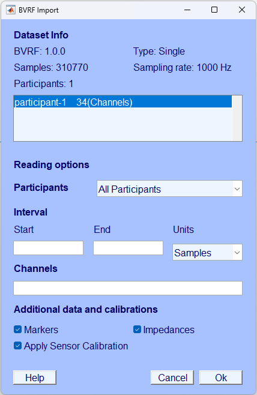

# BrainVision BVRF Reader – MATLAB/EEGLAB Plugin

This plugin lets you import BrainVision Recording Format (BVRF) datasets into MATLAB and EEGLAB. It supports the full BVRF 1.0.0 file set:

- Header: `*.bvrh` 
- Data: `*.bvrd` 
- Marker: `*.bvrm` 
- Impedance: `*.bvri` 

The plugin reads the header, data, markers and impedances, and creates one EEGLAB `EEG` structure per participant.

## Files and functions provided

The plugin consists of three main functions:

1. **`eegplugin_bvrfimport`**  
   EEGLAB plugin entry point. Adds a menu item to EEGLAB:
   > *File → Import data → From BrainVision (BVRF)...*

2. **`pop_loadbvrf`**  
   EEGLAB “pop_” function with GUI and history support.

3. **`eeg_loadbvrf`**  
   Low-level loader: reads BVRF files and returns EEGLAB `EEG` structs.

---

## Installation


### EEGLAB
1. Copy the plugin folder into your EEGLAB `plugins` directory:
   ```
   eeglab/plugins/bvrfimport/
   ```
2. Start or restart EEGLAB.
3. You should now see a menu entry:  
   **File → Import data → From BrainVision (BVRF)...**


### MATLAB
  Do not need installation. Use the function eeg_loadbvrf directly.


## 1. Using the EEGLAB GUI

### Menu location

> **File → Import data → From BrainVision (BVRF)...**

This opens the BVRF Reader GUI included with the plugin.

### BVRF Reader GUI

The GUI shows:

- Dataset information (BVRF version, data type, sample count, sampling rate)
- Participant list with channel counts
- Options for:
  - Single or multi-participant import
  - Sample interval import (samples or seconds)
  - Channel index selection
  - Marker and impedance import



---

## 2. Using `pop_loadbvrf` (with GUI or scripting)

### Syntax

```matlab
[ALLEEG, com] = pop_loadbvrf(hdrPath, hdrFileName, 'key', value, ...);
[ALLEEG, com] = pop_loadbvrf;  % launches GUI
```

### Optional parameters

| Parameter | Description |
|----------|-------------|
| `sampleInterval` | `[first last]` sample indices (1‑based). Empty = full dataset. |
| `channelIndx` | Vector of channel indices. Empty = all. |
| `flagImportMarkers` | `true`/`false` (default true). |
| `flagImportImpedances` | `true`/`false` (default false). |
| `participantId` | Import only this participant. |

### Example

```matlab
[ALLEEG, com] = pop_loadbvrf('/data/', 'rec.bvrh', ...
    'sampleInterval', [0 100000], ...
    'channelIndx', 1:32, ...
    'flagImportMarkers', true);
```

---

## 3. Using `eeg_loadbvrf` directly (low-level loader)

### Syntax

```matlab
[hdr, ALLEEG] = eeg_loadbvrf(hdrPath, hdrFileName, 'key', value, ...);
```

### Example

```matlab
[hdr, ALLEEG] = eeg_loadbvrf('/data/', 'rec.bvrh', ...
    'sampleInterval', [0 600000], ...
    'flagImportMarkers', true, ...
    'verbose', true);
```

---

## How BVRF fields map to EEGLAB

- **Sampling rate** → `EEG.srate`
- **Data** (from `*.bvrd`) → `EEG.data`
- **Channels** → `EEG.chanlocs` (coordinates extracted when available)
- **Reference** computed from channel `Composition.Minus`
- **Markers** → mapped to `EEG.event`
- **Impedances** → stored in `EEG.etc.impedances`
- **Full header** → stored in `EEG.etc.bvrf_header`

---

## Known limitations

- Polynomial `Coefficients` from BVRF are not yet applied beyond `ResolutionPerBit`.

---

## License
MIT

